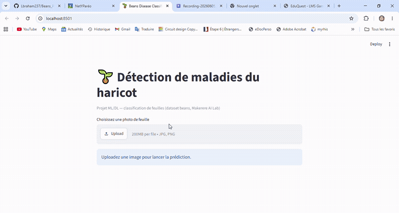

# 🌱 Beans Disease Classifier

> Détection automatique de maladies du haricot par photo — Machine Learning & Deep Learning

[](https://beansprojet-cx7e3tuahngmv6oexwsust.streamlit.app/)


---

## Demo



**[→ Tester l'application en ligne](https://beansprojet-cx7e3tuahngmv6oexwsust.streamlit.app/)**

---

## Résultats

| Modèle | Accuracy | F1 macro |
|--------|----------|----------|
| Logistic Regression (baseline) | 63.3 % | 0.634 |
| CNN from scratch | 79.7 % | 0.795 |
| **Transfer Learning (MobileNetV2)** | **86.7 %** | **0.867** |

Le transfer learning surpasse la baseline de **+23 points** grâce aux features ImageNet pré-entraînées.

---

## Problématique

Diagnostiquer l'état sanitaire d'une feuille de haricot à partir d'une photo smartphone — 3 classes : **tache angulaire**, **rouille** et **saine**. Enjeu concret : outil de diagnostic mobile pour petits exploitants agricoles.

Dataset : [`beans`](https://www.tensorflow.org/datasets/catalog/beans) — Makerere AI Lab (1 295 images)

---

## Stack technique

- **ML classique** : Logistic Regression avec régularisation L1/L2/ElasticNet (scikit-learn)
- **Deep Learning** : CNN from scratch + Transfer Learning MobileNetV2 (TensorFlow/Keras)
- **Inférence** : ONNX Runtime (déploiement sans dépendance TensorFlow)
- **Dashboard** : Streamlit — upload image → prédiction + probabilités en temps réel
- **CI/CD** : GitHub Actions + pytest

---

## Structure

```
beans-project/
├── src/
│   ├── data_loader.py      # chargement dataset + augmentation
│   ├── ml_baseline.py      # baseline LogReg
│   ├── models.py           # CNN + MobileNetV2
│   ├── training.py         # callbacks, scheduler, early stopping
│   └── evaluation.py       # métriques, confusion matrix
├── app/dashboard.py        # dashboard Streamlit
├── models/
│   ├── transfer_beans.onnx # modèle déployé (ONNX)
│   └── transfer_beans.keras
├── notebooks/projet_beans.ipynb
└── tests/test_pipeline.py
```

---

## Lancement local

```bash
python -m venv .venv && .venv\Scripts\activate
pip install -r requirements-dev.txt
streamlit run app/dashboard.py
```

---

## Auteurs

**MVOGO Abraham** & **MAAROUFI Abdelhamid** — M1 IA, IPSSI Lyon
